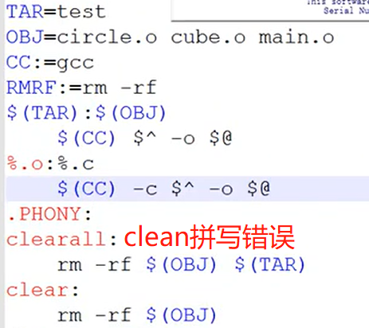

## Linux编译过程


### 0. 源文件

```c
#include<stdio.h>

#define STR "Hello world!!"
#define PRT printf


int main(){
    PRT(STR);
    getchar();
    return 0;
}
```


### 1. 预处理

`gcc -E hello.c -o hello.i`

（1）把宏定义全部替换：

```c
# 7 "hello.c"
int main(){
    printf("Hello world!!");
    getchar();
    return 0;
}
```

（2）引入头文件

```c
# 1 "hello.c"
# 1 "<built-in>"
# 1 "<command-line>"
# 31 "<command-line>"
# 1 "/usr/include/stdc-predef.h" 1 3 4
...
extern int printf (const char *__restrict __format, ...);
...
int main(){
    ...
}
```


### 2. 汇编

`gcc -S hello.i -o hello.S`

就是把`hello.c`用汇编翻译过来，同时包含了连接文件

```asm
	.file	"hello.c"
	.text
	.section	.rodata
.LC0:
	.string	"Hello world!!"
	.text
	.globl	main
	.type	main, @function
main:
.LFB0:
	.cfi_startproc
	endbr64
	pushq	%rbp
	.cfi_def_cfa_offset 16
	.cfi_offset 6, -16
	movq	%rsp, %rbp
	.cfi_def_cfa_register 6
	leaq	.LC0(%rip), %rdi
	movl	$0, %eax
	call	printf@PLT
	call	getchar@PLT
	movl	$0, %eax
	popq	%rbp
	.cfi_def_cfa 7, 8
	ret
	.cfi_endproc
.LFE0:
	.size	main, .-main
	.ident	"GCC: (Ubuntu 9.3.0-17ubuntu1~20.04) 9.3.0"
	.section	.note.GNU-stack,"",@progbits
	.section	.note.gnu.property,"a"
	.align 8
	.long	 1f - 0f
	.long	 4f - 1f
	.long	 5
0:
	.string	 "GNU"
1:
	.align 8
	.long	 0xc0000002
	.long	 3f - 2f
2:
	.long	 0x3
3:
	.align 8
4:
```


### 3.  编译

`gcc -c hello.S -o hello.o`

有`hello.S`生成二进制文件


### 4. 连接

`gcc hello.o -o hello`

生成可执行文件，链接了大量的库文件，可以看到文件大小变大了10倍


## Makefile

可参考博客：https://blog.csdn.net/yredh_114/article/details/69389134


1. Makefile文件名必须为`Makefile`
2. #是注释


### 1. 显示规则

```makefile
目标文件:依赖文件
[TAB]指令
```

例子：

执行`hello.c`的预处理过程

```makefile
hello.i:hello.c
	gcc -E hello.c -o hello.i  		# 指令一点都省不了
```


#### 1.1 顺序要求

第一个目标文件要是我的最终目标，Makefile的过程是一个递归过程：

```makefile
hello:hello.o
	gcc hello.o -o hello

hello.o:hello.S
	gcc -c hello.s -o hello.o

hello.S:hello.i
	gcc -S hello.i -o hello.s

hello.i:hello.c	
	gcc -E hello.c -o hello.i
```

> y注：小写的gcc指令是常用的 -o -c

效果：

```shell
yjr@DESKTOP-FFJQEHV:/mnt/d/workspace/OS/background-knowledge$ make
gcc -E hello.c -o hello.i
gcc -S hello.i -o hello.s
gcc -c hello.s -o hello.o
gcc hello.o -o hello
```


#### 1.2 伪目标

make 指令后面的参数对应的执行方式

```makefile
.PHONY:
clean:
	rm -rf hello.o hello.S hello.i hello
```

效果：

```shell
yjr@DESKTOP-FFJQEHV:/mnt/d/workspace/OS/background-knowledge$ make clean
rm -rf hello.o hello.S hello.i hello
```


#### 1.3 多文件连接


### 2. 变量

#### 2.1 变量**赋值**规则

```makefile
=	（替换）
+=	（追加）
:=	（恒等于）可以理解为常量
```


#### 2.2 变量**使用**规则

变量要使用必须表示为`$(变量名)`

例如1.3中的第一部分可以写为如下形式：


### 3.  隐含规则（通配符）

%.c %.o 任意的.c或者.o

*.c *.o 所有的.c或者.o

例子，将任意c代码生成可连接文件

```makefile
CC := gcc
%.o:%.c
	$(CC) -c %.c -o %.o
```


### 4. 自动变量

$^ 所有的依赖文件

$@ 所有的目标文件

$< 所有的依赖文件的第一个文件

还有：


注：自动变量只能用在**指令**位置上


例子：（clean还是拼错了）




### 5. 函数


## 头文件

