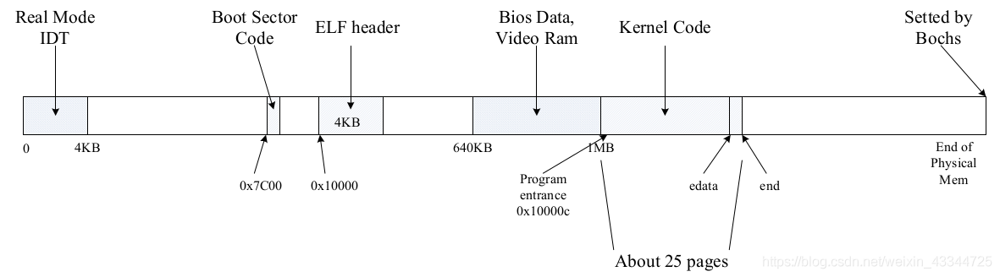

# jos学习笔记

由于`操作系统导论`该课本主要介绍的操作系统的核心概念，缺少了很多实现代码，更不像CSAPP一样在课本中对lab代码提供详细的说明，本书和 `jos` 以及`xv6`之间并没有紧密的连接，所以写下自习笔记。


## Step 1 代码框架

```
workdir
|------ GNUmakefile
|
|------ boot
|         |---- Makefrag
|         |---- boot.S
|         |---- main.c
|------ fs
|
|------ inc
|
|------ kern
|         |---- Makefrag
|         |---- kernel.ld
|         |---- entry.S
|         |---- entrypgdir,c
|         |---- init.c
|         |---- monitor.c
|         |---- monitor.h
|         |---- kdebug.c
|         |---- kdebug.h
|         |---- printf.c
|         |---- console.c
|         |---- console.h
|
|------ user
|
|------ conf
|         |---- env.mk
|         |---- lab.mk

```


启动流程：

boot阶段：

boot.S开始，main.c结束

复制kernel代码进入到物理内存中

用 readseg 函数依次将文件的每一段读入内存中相应的位置

即调用复制到内存中的函数 从入口点开始执行 即entry.S文件


init阶段：

代码位于kern中，从entry.S开始，调用init.c


刚进入init阶段的时候物理地址如下：



entry.S尚未启用虚拟内存，但是entry.S之后的所有代码均是按照虚拟内存的方式写的，编写的代码位置是`[KERNBASE, KERNBASE+4MB)`，需要在inti.c中将其映射到物理地址`[0, 4MB)`上，所以这时候需要将所有的物理内存进行一个映射


```c
for cpu in cpus:
	从mpentry.S启动AP（与boot相似），进入mp_main初始化AP
		1. 内存映射I/O，使能正确访问LAPIC
		2. 环境初始化（GDT）
		3. 中断初始化
		4. 设置cpu_status为CPU_STARTED
		5. while(1)自旋
	// BSP忙等待AP初始化完毕
	while cpu.cpu_status != CPU_STARTED:
		pass
```

