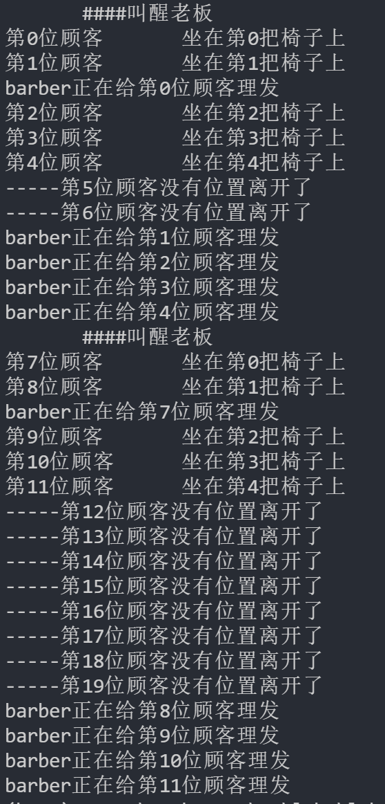
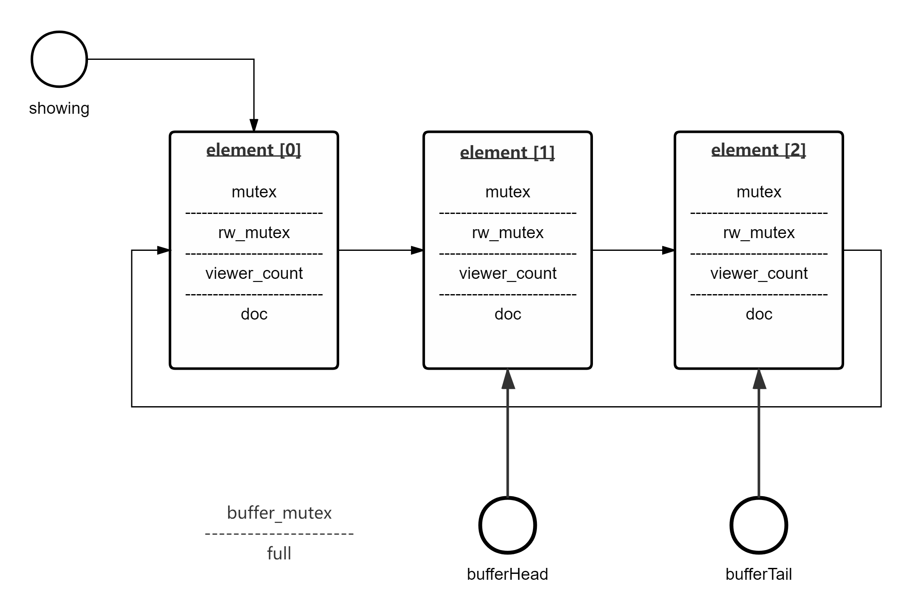
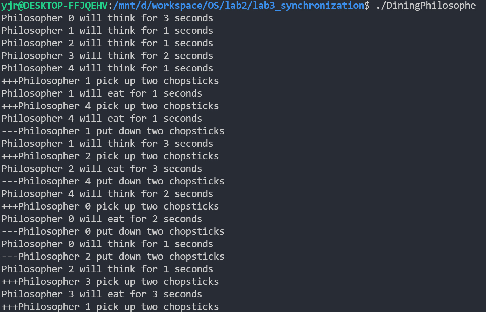

# 									实验报告


## 1 复旦理发师问题

### 1.1 关系分析（Q1）

这是一个典型的生产者消费者的有界缓冲区问题。在这道题目中，生产者是理发顾客`customer`，消费者是理发师`barber`，有界缓存区就是k 把供顾客等待坐的椅子`CHAIRS`，缓冲区中要放入的就是前来理发的顾客`customer`。

根据**课本**所给出的生产者消费者的有界缓冲区问题一般情况，在使用信号量`semaphore`的情况下， 生产者和消费者一般要共享以下数据结构：

```c
/*-------一般生产者消费者的有界缓冲区信号量模型----------*/
int n;	 						// 将缓冲区的大小
semaphore mutex = 1; 			// 提供缓冲区访问的互斥要求
semaphore empty = n;			// 缓冲区空闲的数量
semaphore full = 0;         	// 缓冲区被填充的数量
```

**课本**中生产者进程结构：

```c
do{
    wait(empty);			//使用一个空闲区
    wait(mutex);			//缓冲区互斥
    /*具体代码执行部分*/
    signal(mutex);
    signal(full)			//添加一个非空闲区
}while(true);
```

**课本**中消费者进程结构：

```c
do{
    wait(full);				//使用一个非空闲区
    wait(mutex);			//缓冲区互斥
    /*具体代码执行部分*/
    signal(mutex);
    signal(empty)			//添加一个空闲区
}while(true);
```

但是，由于题目中要求当排队人数超过椅子`CHAIRS`数量的时候，生产者`customer`就不再生产，选择离开，也就是**不需要**`semaphore empty`用来**同步**生产者的生产速度，而是需要一个新的量，`waiting`用来记录等待人数，这就需要提供**新的信号量**`semaphore waiting_mutex`来提供互斥要求。

所以在该题目下，生产者`customer`和消费者`barber`共享以下数据结构：

```c
#define CHAIRS 5 				// 将缓冲区的大小定义为5
semaphore mutex = 1; 			// 提供缓冲区访问的互斥要求
semaphore waiting_mutex = 1;	// 提供等待人数访问的互斥要求
semaphore full = 0;   			// 缓冲区被填充的数量
```

`semaphore mutex  `提供缓冲区访问的互斥要求，理发师让下一个顾客来理发，和新的顾客到理发店，在时间上总存在先后，所以缓冲区的访问是互斥的。

`semaphore waiting_mutex`用来限制等待人数的修改，理发师理完一个人，要对等待人数`waiting`-1，而每当有一个顾客成功进入队列，要对等待人数`waiting`+1，理发师和顾客不能同时修改等待人数。

`semaphore full`缓冲区被填充的数量，若`full`为0，则理发店老板`barber`睡觉，进入等待模式，直到有顾客来使得，老板被叫醒。

由于在该实现所以在该题目下，由于`mutex`和`waiting_mutex`只是提供互斥，没有必要使用信号量，改为互斥量`pthread_mutex_t`，所以==最后==生产者`customer`和消费者`barber`共享以下数据结构：

```c
#define CHAIRS 5 				// 将缓冲区的大小定义为5
pthread_mutex_t mutex = PTHREAD_MUTEX_INITIALIZER;         // 提供缓冲区访问的互斥要求
pthread_mutex_t waiting_mutex = PTHREAD_MUTEX_INITIALIZER; // 提供等待人数访问的互斥要求
semaphore full;                                            // 缓冲区被填充的数量
```


### 1.2 进程实现（Q2）

根据生产者消费者的有界缓冲区模型，可以实现至少2个进程，生产者是理发顾客`customer`，消费者是理发师`barber`。我在本题的处理中，每一个顾客是一个线程，理发师是一个线程来处理顾客的理发需求。

为了方便数据的共享，下面代码是使用**线程**的方式实现的该问题，使用`pthreads`进行同步。

#### 1.2.1 缓冲区

根据问题分析中的**缓冲区**模型，下面定义缓冲区，缓冲区就是等待顾客的椅子`chairs`，使用一个`int`数组记录每位到来的顾客的`id`，`id`就是顾客前来的顺序，从0开始依次增加。

```c
int chairs[CHAIRS];    //缓冲区数组
int nextCustomers = 0; //指向下一位等待的顾客
int nextChair = 0;     //指向下一个空椅子
```


#### 1.2.2 生产者——顾客

在实现中每一位顾客`customer`都是一个线程，与一般模型不同，在处理等待人数的时候，如果等待人数超过椅子`CHAIRS`的数量，顾客就离开，不会阻塞在理发店门口，所以这里使用if语句进行判断。

```c
void *customer(void *num)
{
    pthread_mutex_lock(&waiting_mutex);
        if (waiting < CHAIRS)
        {
            //等待人数加一
            waiting += 1;

            pthread_mutex_lock(&mutex);//顾客坐上椅子等待被叫
                /* 中间处理缓冲区的修改*/
            pthread_mutex_unlock(&mutex);
            pthread_mutex_unlock(&waiting_mutex);  
            sem_post(&full);		//使用信号量 告诉理发师有客人来
        }
        else
        {
            // 顾客没有位置离开
            pthread_mutex_unlock(&waiting_mutex); 
        }   
}
```


#### 1.2.3 消费者——理发师

消费者`barber`的结构与典型的生产者消费者的有界缓冲区一致，只是最后的等待人数`waiting`使用互斥量手动修改，而不是直接用信号量来修改。

```c
void *barber(void)
{
    while (1)
    {
        sem_wait(&full);            //使用信号量 等待客人来
      
        pthread_mutex_lock(&mutex); //有客人，读取客人id 进行理发
			/* 中间处理缓冲区的修改*/
        pthread_mutex_unlock(&mutex);

        //送走客人
        pthread_mutex_lock(&waiting_mutex);
        waiting -= 1;
        pthread_mutex_unlock(&waiting_mutex);
    }
}
```


#### 1.2.4 main函数

main函数就是初始化线程，并逐一释放顾客线程。

这里定义等待椅子数量`CHAIRS`为5，总的顾客前来数量` num_customers`为20

为了模拟顾客的竞争，这里不使用`sleep()`函数主动让线程休眠，而是让线程自己自由竞争。

```c
int main()
{
    pthread_t p_barber;
    pthread_t p_customers[20];

    int num_customers = 20;

    sem_init(&full, 0, 0);

    pthread_create(&p_barber, 0, barber, 0);
    // 用于传入用户ID
    int nums[num_customers];
    for (int i = 0; i < num_customers; i++)
    {
        nums[i] = i;
        pthread_create(&p_customers[i], 0, customer, &nums[i]);
        if (i == 6)			//有6个顾客后，暂时停止对顾客生成，让理发师处理现有顾客
            sleep(1);
    }
    for (int i = 0; i < num_customers; i++)
    {
        pthread_join(p_customers[i], 0);
    }
    sleep(10);
    return 0;
}
```


#### 1.2.5 输出演示

注：有6个顾客后，暂时停止对顾客生成，让理发师处理现有顾客，结果如下




## 2 直播间问题

### 2.1 关系分析（Q1）

这是一个**读者-作者**问题，但其中为了实现纪录片的顺序播放又包含了**生产者消费者的有界缓冲区**问题。在这道题目中，我的实现分成两个层次，将有不同需求的用户进行分类，有相同需求的用户进入同一个`element`等待。

**读者-作者层**：直播间`liveroom`是作者，用户`viewer`是读者，且满足读者优先，指针`showing `指向正在放映的`element`，在每一个`element`内部实现读者作者关系。

**生产者消费者层**：第一个进入直播间、决定下一部纪录片的B站观众` viewer`是作者，他选择了当前直播间播放的纪录片或者之后要观看的纪录片，这样的一个用户viewer会在生产者消费者的`buffer`上填充一个`element`。

实现的概览如下：



#### 2.1.1 课本案例分析

根据**课本**给出的读者-作者模型，读者和作者共享以下数据结构：

```c
semaphore rw_mutex = 1;			//用于读者和作者的互斥
semaphore mutex = 1;			//用于确保read_count更新时的互斥
int read_count = n;
```

变量`read_count`用于记录同时在读取的读者，由于读和写不是一一对应的关系，不能向生产者消费者一样就用信号量同步读写数量，所以必须用一个变量来记录同时在读的人数。在本题中使用变量`viewer_count`来记录观众的人数。


#### 2.1.2 本题关系分析

##### (1) 读者-作者层

上面`2.1.1`中的结构是读者优先，只要还有读者在读，作者就被阻塞。对应**本题**，作者就是直播间`liveRoom`，读者就是`viewer`，我为每一部纪录片分配了一组信号量，当直播间`liveRoom`开始播放对应纪录片，也就是指针`showing`指向对应的`element`时，这里执行的是一个完整的读者-作者模型。对`Element`结构做如下定义：

```c
typedef struct element
{
    semaphore mutex;    //用于确保该纪录片的viewer_count更新时的互斥 第一个viewer初始化为0 阻塞其他viewer
    semaphore rw_mutex; //用于确保该读写时的互斥 第一个viewer初始化为0 等待liveRoom sem_post开始播放纪录片
    int viewer_count;   //正在观看的人数 初始化为0
    Doc doc;            //要观看的纪录片
} Element;
```


##### (2) 生产者消费者层

题目中第3点要求，等待观看其他纪录片的 b 站用户按到达顺序排队，这里又**嵌套**了一个生产者消费者的有界缓冲区问题，满足了正在观看的观众`viewer`要**按顺序**去满足接下来的观众。在这一条件下，生产者是第一个产生需求的` viewer`，消费者是直播间`liveRoom`。

所以在该题目下，生产者` viewer`，消费者`liveRoom`使用以下信号量：

```c
semaphore element_mutex = 1; 	// 提供缓冲区访问的互斥要求
semaphore full = 0;   			// 缓冲区被填充的数量
/*注本题中不需要缓冲区空闲的数量的信号，主要是因为纪录片数量有限，不会超过缓冲区大小。*/
```

生产者` viewer`和消费者`liveRoom`的缓冲区：

```c
#define ELEMENTS 3 // 将缓冲区的大小定义为3
//缓冲区
Element buffer[ELEMENTS]; //使用element数组作为buffer
int bufferHead = 0;       //指向下一个要播放的element
int bufferTail = 0;       //指向最后一个要播放的element
```

`element_mutex  `提供缓冲区访问的互斥要求，每一个观众`viewer`进入直播间，要必须先进入元素`Element`的数组，进行用户的**分类**，并进入到对应的纪录片下，如果存在对应元素`Element`，就在元素`Element`中增加`viewer_count`，如果没有元素`Element`有对应的纪录片，则生成一个有对应的纪录片元素`Element`，完成生产者的生产。


### 2.2 进程实现（Q2）

#### 2.2.1 主要数据结构

定义纪录片的数据结构：

```c
typedef struct documentary
{
    char name[16]; //纪录片名称
    int DID;       //纪录片ID
    int dTime;     //纪录片时长
} Doc;
```

定义用户的数据结构：

```c
typedef struct user
{
    int UID;   //用户ID
    Doc doc;   //要观看的纪录片
    int uTime; //用户预期观影时间
} User;
```

每一个用户`User`会存储自己要看的纪录片的数据结构`Doc doc`，在本题目中，虽然定义了这些数据结构，但是仅使用了纪录片ID`DID`和用户ID`UID`，来进行直播过程的控制。


#### 2.2.2 直播间

```c
void *liveRoom(void)
{
    while (1)
    {
        sem_wait(&full); //等待有纪录片被选择

        sem_wait(&buffer_mutex); 
        //从缓存区读取下一部纪录片，并更新头指针
        sem_post(&buffer_mutex);
        
        sem_post(&(showing->rw_mutex)); //开始播放纪录片

        sem_wait(&(showing->rw_mutex)); //等待所有观众离开 开始下一轮写
    }
}
```


#### 2.2.3 观众

```c

void *viewer(void *user)
{    
    if (正在播放的是该用户要看的)
    {
        sem_wait(&(showing->mutex));
        showing->viewer_count += 1; 	//用户进入开始观看
        sem_post(&(showing->mutex));
    }
    else
    {
        // 一个观众进入直播间后发现正在播放的不是自己要看的电影，于是进入buffer进行排队
        if (buffer中有相同的等候观众)
        {
            sem_wait(&(buffer[i].mutex));
            buffer[i].viewer_count += 1; 	//用户进入开始观看
            sem_post(&(buffer[i].mutex));
        }
        // 如果没有进到某个纪录片下等待，他是第一个想看该纪录片的观众，他要生成一个element
        else
        {
            //首先作为生产者写buffer
            sem_wait(&buffer_mutex); //从缓存区读取下一部纪录片
            // 作为生产者将需求写入buffer中
            // 初始化读写互斥量
            sem_init(&(buffer[bufferTail].mutex), 0, 0)；
            sem_init(&(buffer[index].rw_mutex), 0, 0);
            sem_post(&buffer_mutex);
            
            // buffer中的填充数量增加1
            sem_post(&full);

            // 等待作者 ：直播间开始播放对应的纪录片
            sem_wait(&(buffer[index].rw_mutex));
            // 释放读者数量的读写
            sem_post(&(buffer[index].mutex));
        }
    }
    
    //读者退出部分  这里没有考虑用户被踢出的情况
    sem_wait(&(showing->mutex));
    showing->viewer_count -= 1;
    if (是最后一个用户)
        sem_post(&(showing->rw_mutex));		//释放直播间的占用
    sem_post(&(showing->mutex));
}
```


#### 2.2.4 main函数和测试部分

main函数就是初始化线程，并逐一释放`viewer`线程。

这里根据题目的要求纪录片数量`ELEMENTS`为3，总的顾客前来数量` num_viewers`为50

三部纪录片ID分别为`0、1、2`，用户ID就从`0`一直到`49`.

为了模拟顾客的竞争，这里不使用`sleep()`函数主动让线程休眠，而是让线程自己自由竞争。

用户的初始化函数：

```c
void initUsers()
{
    int i = 0;
    for (i = 0; i < 20; ++i)
    {
        users[i].UID = i;
        users[i].doc.DID = 0;
        users[i].uTime = 0; //暂时没有用
    }
    users[1].doc.DID = 2;	//设置用户要看的纪录片
    users[3].doc.DID = 1;	//设置用户要看的纪录片
    for (i = 20; i < 50; ++i)
    {
        users[i].UID = i;
        users[i].doc.DID = (i % 3); 	//设置用户要看的纪录片
        users[i].uTime = 0; //暂时没有用
    }
}
```


#### 2.2.5 输出演示

注由于每次的输出顺序都不同，下面仅为示例。

```txt
#######纪录片2开始播放
+++用户1开始观看纪录片2
---用户1看完了，要离开直播间
+++用户23开始观看纪录片2
+++用户20开始观看纪录片2
---用户23看完了，要离开直播间
+++用户26开始观看纪录片2
---用户20看完了，要离开直播间
+++用户29开始观看纪录片2
---用户26看完了，要离开直播间
---用户29看完了，要离开直播间
+++用户32开始观看纪录片2
+++用户35开始观看纪录片2
---用户32看完了，要离开直播间
+++用户38开始观看纪录片2
---用户38看完了，要离开直播间
---用户35看完了，要离开直播间
+++用户41开始观看纪录片2
---用户41看完了，要离开直播间
+++用户44开始观看纪录片2
+++用户47开始观看纪录片2
---用户44看完了，要离开直播间
---用户47看完了，要离开直播间
#######纪录片2结束
#######纪录片1开始播放
+++用户3开始观看纪录片1
---用户3看完了，要离开直播间
+++用户22开始观看纪录片1
---用户22看完了，要离开直播间
+++用户25开始观看纪录片1
+++用户28开始观看纪录片1
---用户25看完了，要离开直播间
+++用户31开始观看纪录片1
---用户28看完了，要离开直播间
+++用户34开始观看纪录片1
---用户31看完了，要离开直播间
+++用户37开始观看纪录片1
---用户37看完了，要离开直播间
---用户34看完了，要离开直播间
+++用户40开始观看纪录片1
+++用户43开始观看纪录片1
---用户43看完了，要离开直播间
---用户40看完了，要离开直播间
+++用户46开始观看纪录片1
+++用户49开始观看纪录片1
---用户46看完了，要离开直播间
---用户49看完了，要离开直播间
#######纪录片1结束
#######纪录片0开始播放
+++用户6开始观看纪录片0
+++用户2开始观看纪录片0
---用户6看完了，要离开直播间
+++用户4开始观看纪录片0
---用户2看完了，要离开直播间
+++用户5开始观看纪录片0
---用户4看完了，要离开直播间
+++用户0开始观看纪录片0
---用户5看完了，要离开直播间
+++用户8开始观看纪录片0
---用户0看完了，要离开直播间
+++用户9开始观看纪录片0
---用户9看完了，要离开直播间
+++用户10开始观看纪录片0
---用户10看完了，要离开直播间
---用户8看完了，要离开直播间
+++用户11开始观看纪录片0
+++用户12开始观看纪录片0
---用户12看完了，要离开直播间
---用户11看完了，要离开直播间
+++用户13开始观看纪录片0
+++用户14开始观看纪录片0
---用户14看完了，要离开直播间
---用户13看完了，要离开直播间
+++用户15开始观看纪录片0
+++用户16开始观看纪录片0
---用户15看完了，要离开直播间
+++用户17开始观看纪录片0
---用户17看完了，要离开直播间
---用户16看完了，要离开直播间
+++用户18开始观看纪录片0
---用户18看完了，要离开直播间
+++用户19开始观看纪录片0
+++用户21开始观看纪录片0
---用户19看完了，要离开直播间
---用户21看完了，要离开直播间
+++用户7开始观看纪录片0
---用户7看完了，要离开直播间
+++用户24开始观看纪录片0
---用户24看完了，要离开直播间
+++用户27开始观看纪录片0
---用户27看完了，要离开直播间
+++用户30开始观看纪录片0
---用户30看完了，要离开直播间
+++用户33开始观看纪录片0
---用户33看完了，要离开直播间
+++用户36开始观看纪录片0
---用户36看完了，要离开直播间
+++用户39开始观看纪录片0
---用户39看完了，要离开直播间
+++用户42开始观看纪录片0
---用户42看完了，要离开直播间
+++用户45开始观看纪录片0
---用户45看完了，要离开直播间
+++用户48开始观看纪录片0
---用户48看完了，要离开直播间
#######纪录片0结束
```

在用户生成中短暂休眠：

```c
pthread_create(&p_viewer[i], 0, viewer, &users[i]);
if(i == 25)
    sleep(1);
```

结果：

```txt
#######纪录片0开始播放
+++用户0开始观看纪录片0
+++用户2开始观看纪录片0
---用户0看完了，要离开直播间
+++用户4开始观看纪录片0
---用户2看完了，要离开直播间
+++用户5开始观看纪录片0
---用户4看完了，要离开直播间
+++用户6开始观看纪录片0
---用户5看完了，要离开直播间
+++用户7开始观看纪录片0
---用户6看完了，要离开直播间
+++用户8开始观看纪录片0
---用户7看完了，要离开直播间
+++用户18开始观看纪录片0
---用户8看完了，要离开直播间
+++用户10开始观看纪录片0
---用户18看完了，要离开直播间
+++用户11开始观看纪录片0
---用户10看完了，要离开直播间
---用户11看完了，要离开直播间
+++用户12开始观看纪录片0
+++用户13开始观看纪录片0
---用户13看完了，要离开直播间
---用户12看完了，要离开直播间
+++用户14开始观看纪录片0
---用户14看完了，要离开直播间
+++用户15开始观看纪录片0
---用户15看完了，要离开直播间
+++用户16开始观看纪录片0
---用户16看完了，要离开直播间
+++用户17开始观看纪录片0
---用户17看完了，要离开直播间
+++用户9开始观看纪录片0
+++用户19开始观看纪录片0
---用户9看完了，要离开直播间
+++用户21开始观看纪录片0
---用户19看完了，要离开直播间
+++用户24开始观看纪录片0
---用户21看完了，要离开直播间
---用户24看完了，要离开直播间
#######纪录片0结束
#######纪录片2开始播放
+++用户1开始观看纪录片2
---用户1看完了，要离开直播间
+++用户20开始观看纪录片2
---用户20看完了，要离开直播间
+++用户23开始观看纪录片2
---用户23看完了，要离开直播间
#######纪录片2结束
#######纪录片1开始播放
+++用户3开始观看纪录片1
+++用户22开始观看纪录片1
---用户3看完了，要离开直播间
---用户22看完了，要离开直播间
+++用户25开始观看纪录片1
---用户25看完了，要离开直播间
#######纪录片1结束
#######纪录片2开始播放
+++用户26开始观看纪录片2
---用户26看完了，要离开直播间
+++用户29开始观看纪录片2
---用户29看完了，要离开直播间
+++用户32开始观看纪录片2
+++用户35开始观看纪录片2
---用户32看完了，要离开直播间
+++用户38开始观看纪录片2
---用户35看完了，要离开直播间
+++用户41开始观看纪录片2
---用户38看完了，要离开直播间
+++用户44开始观看纪录片2
---用户41看完了，要离开直播间
+++用户47开始观看纪录片2
---用户47看完了，要离开直播间
---用户44看完了，要离开直播间
#######纪录片2结束
#######纪录片0开始播放
+++用户27开始观看纪录片0
+++用户30开始观看纪录片0
---用户27看完了，要离开直播间
+++用户33开始观看纪录片0
---用户30看完了，要离开直播间
+++用户36开始观看纪录片0
---用户33看完了，要离开直播间
+++用户39开始观看纪录片0
---用户39看完了，要离开直播间
---用户36看完了，要离开直播间
+++用户42开始观看纪录片0
+++用户45开始观看纪录片0
---用户42看完了，要离开直播间
---用户45看完了，要离开直播间
+++用户48开始观看纪录片0
---用户48看完了，要离开直播间
#######纪录片0结束
#######纪录片1开始播放
+++用户28开始观看纪录片1
---用户28看完了，要离开直播间
+++用户31开始观看纪录片1
+++用户34开始观看纪录片1
---用户31看完了，要离开直播间
+++用户37开始观看纪录片1
---用户34看完了，要离开直播间
---用户37看完了，要离开直播间
+++用户40开始观看纪录片1
+++用户43开始观看纪录片1
---用户40看完了，要离开直播间
+++用户46开始观看纪录片1
---用户43看完了，要离开直播间
+++用户49开始观看纪录片1
---用户49看完了，要离开直播间
---用户46看完了，要离开直播间
#######纪录片1结束
```


## 3 哲学家就餐问题

### 3.1 问题分析

哲学家就餐问题本身就是一个最典型的同步问题，主要是要避免**死锁**，要避免死锁的方式多种多样，这里使用的方式是使用通过协议来预防和避免死锁。


### 3.2 问题解决

使用最简单的办法来避免死锁，我们规定单数序号的哲学家，第一次拿筷子只能拿右边的筷子；双数序号的哲学家，第一次拿筷子只能拿左边的筷子。

这样一来，我们就是限制了竞争的顺序，第一次拿筷子的哲学家只会和第一次拿筷子的哲学家竞争，第二次拿筷子的哲学家只会和第二次拿筷子的哲学家竞争，不会出现死锁。

```c
void pickUp(int philosopherNumber)
{
	/*Your code here*/
	// 限制拿筷子的顺序
	pthread_mutex_lock(&chopsticks[(philosopherNumber + (philosopherNumber % 2)) % NUMBER_OF_PHILOSOPHERS]);
	pthread_mutex_lock(&chopsticks[(philosopherNumber + ((philosopherNumber + 1) % 2)) % NUMBER_OF_PHILOSOPHERS]);
	printf("+++Philosopher %d pick up two chopsticks\n", philosopherNumber);
}
```


```c
void putDown(int philosopherNumber)
{
	/*Your code here*/
	pthread_mutex_unlock(&chopsticks[(philosopherNumber + ((philosopherNumber + 1) % 2)) % NUMBER_OF_PHILOSOPHERS]);
	pthread_mutex_unlock(&chopsticks[(philosopherNumber + (philosopherNumber % 2)) % NUMBER_OF_PHILOSOPHERS]);
	printf("---Philosopher %d put down two chopsticks\n", philosopherNumber);
}
```


### 3.3 输出演示


